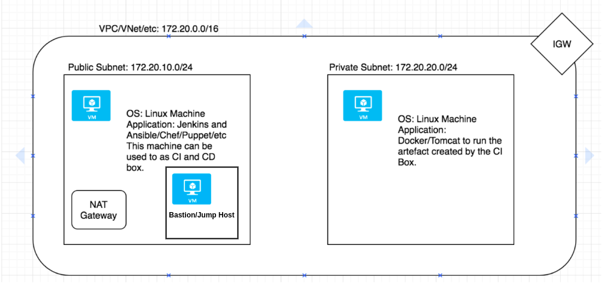

# tf_example_project
sample project for spinning and configuring aws infra by terraform and deploying the application using Ansible


## Description
This Project is an example real-workd scenerio for Build and Deploy os End-to-End Application in container.


## Technologies Used
1. Terraform (IaC)
2. Docker
3. Jenkins (CI)
4. Ansible (Deployment Tool)
5. AWS Cloud
6. Java Springboot Application

## Instructions

The current Repo consists of Terraform and Ansible scripts

### 1. Terraform:



After cloning the Repo follow the below commads to spin up the infra (Prequisite: Aws Configure should be in place)

```Terraform
terraform init
terraform apply -auto-approve
```


### 2. Ansible:

To deploy the Application Docker Image Use the following command.

```bash
ansible-playbook Ansible/deploy.yml -i Ansible/hosts -e ansible_ssh_private_key_file="~/.ssh/Mykey"
```

### Application Repository: https://github.com/KoppulaRajender/spring-petclinic
